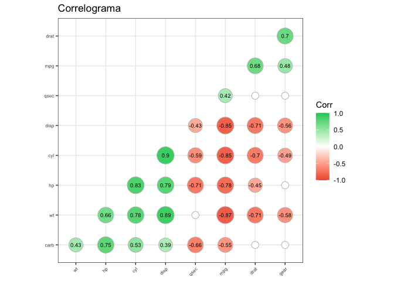
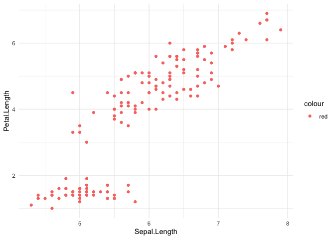

Testes Estatísticos e Visualizações para o dia a dia
================
Rodrigo Almeida Figueira
15/03/2021

<!-- README.md is generated from README.Rmd. Please edit that file -->

## Motivação

No nosso dia a dia de trabalho chegam diversas demandas, muitas delas
complexas, cheias de desenvolvimentos e aplicações de técnicas, mas
existem outras que são mais leves, pois requerem uma análise mais direta
e prática. Neste material, tentarei abordar algumas opções de técnincas
estatísticas e de vizualizações que nos respondem questionamentos
simples, com um devido embasamento para nossas afirmações.

## Ambientação à situação problema

Vamos firmar aqui, alguns termos que serão utilizados neste material:

  - Hipótese: Será o “questionamento” que faremos para obtermos
    respostas

  - Teste de Hipótese: Será o teste que nos trará a resposta sobre
    nossos questionamentos

  - Nível descritivo: Será o valor que vamos comparar nossa estatística
    para rejeitar ou não rejeitar nossas hipóteses (mais conhecido como
    p-valor)

## Bases de estudo utilizadas

Para este material utilizarei algumas bases já bem famosas pela
comunidade de ciência de dados. São estas:

  - Mtcars: informações de veículos

  - Auto: informações de veículos antigos

  - Iris: informações de plantas

  - Titanic: informações sobre a tripulação do naufrágio do Navio
    Titanic

<!-- end list -->

``` r
mtcars <- mtcars %>% 
  mutate(
    vs = ifelse(vs == 1, "straight", "V-shaped"),
    am = ifelse(am == 1, "manual", "automatic")
  )

mtcars %>% head() %>% knitr::kable(align = "c")
```

|                   | mpg  | cyl | disp | hp  | drat |  wt   | qsec  |    vs    |    am     | gear | carb |
| :---------------- | :--: | :-: | :--: | :-: | :--: | :---: | :---: | :------: | :-------: | :--: | :--: |
| Mazda RX4         | 21.0 |  6  | 160  | 110 | 3.90 | 2.620 | 16.46 | V-shaped |  manual   |  4   |  4   |
| Mazda RX4 Wag     | 21.0 |  6  | 160  | 110 | 3.90 | 2.875 | 17.02 | V-shaped |  manual   |  4   |  4   |
| Datsun 710        | 22.8 |  4  | 108  | 93  | 3.85 | 2.320 | 18.61 | straight |  manual   |  4   |  1   |
| Hornet 4 Drive    | 21.4 |  6  | 258  | 110 | 3.08 | 3.215 | 19.44 | straight | automatic |  3   |  1   |
| Hornet Sportabout | 18.7 |  8  | 360  | 175 | 3.15 | 3.440 | 17.02 | V-shaped | automatic |  3   |  2   |
| Valiant           | 18.1 |  6  | 225  | 105 | 2.76 | 3.460 | 20.22 | straight | automatic |  3   |  1   |

``` r


auto <- ISLR::Auto %>% 
  mutate(
    origin = ifelse(origin == 1, "American",
                    ifelse(origin == 2, "European", "Japanese"))
  )

auto %>% head() %>% knitr::kable(align = "c")
```

| mpg | cylinders | displacement | horsepower | weight | acceleration | year |  origin  |           name            |
| :-: | :-------: | :----------: | :--------: | :----: | :----------: | :--: | :------: | :-----------------------: |
| 18  |     8     |     307      |    130     |  3504  |     12.0     |  70  | American | chevrolet chevelle malibu |
| 15  |     8     |     350      |    165     |  3693  |     11.5     |  70  | American |     buick skylark 320     |
| 18  |     8     |     318      |    150     |  3436  |     11.0     |  70  | American |    plymouth satellite     |
| 16  |     8     |     304      |    150     |  3433  |     12.0     |  70  | American |       amc rebel sst       |
| 17  |     8     |     302      |    140     |  3449  |     10.5     |  70  | American |        ford torino        |
| 15  |     8     |     429      |    198     |  4341  |     10.0     |  70  | American |     ford galaxie 500      |

``` r

iris %>% head() %>% knitr::kable(align = "c")
```

| Sepal.Length | Sepal.Width | Petal.Length | Petal.Width | Species |
| :----------: | :---------: | :----------: | :---------: | :-----: |
|     5.1      |     3.5     |     1.4      |     0.2     | setosa  |
|     4.9      |     3.0     |     1.4      |     0.2     | setosa  |
|     4.7      |     3.2     |     1.3      |     0.2     | setosa  |
|     4.6      |     3.1     |     1.5      |     0.2     | setosa  |
|     5.0      |     3.6     |     1.4      |     0.2     | setosa  |
|     5.4      |     3.9     |     1.7      |     0.4     | setosa  |

``` r

titanic <- titanic::titanic_train %>% 
  mutate(
    Survived = as.factor(Survived),
    Pclass = as.factor(Pclass)
  )
titanic %>% head() %>% knitr::kable(align = "c")
```

| PassengerId | Survived | Pclass |                        Name                         |  Sex   | Age | SibSp | Parch |      Ticket      |  Fare   | Cabin | Embarked |
| :---------: | :------: | :----: | :-------------------------------------------------: | :----: | :-: | :---: | :---: | :--------------: | :-----: | :---: | :------: |
|      1      |    0     |   3    |               Braund, Mr. Owen Harris               |  male  | 22  |   1   |   0   |    A/5 21171     | 7.2500  |       |    S     |
|      2      |    1     |   1    | Cumings, Mrs. John Bradley (Florence Briggs Thayer) | female | 38  |   1   |   0   |     PC 17599     | 71.2833 |  C85  |    C     |
|      3      |    1     |   3    |               Heikkinen, Miss. Laina                | female | 26  |   0   |   0   | STON/O2. 3101282 | 7.9250  |       |    S     |
|      4      |    1     |   1    |    Futrelle, Mrs. Jacques Heath (Lily May Peel)     | female | 35  |   1   |   0   |      113803      | 53.1000 | C123  |    S     |
|      5      |    0     |   3    |              Allen, Mr. William Henry               |  male  | 35  |   0   |   0   |      373450      | 8.0500  |       |    S     |
|      6      |    0     |   3    |                  Moran, Mr. James                   |  male  | NA  |   0   |   0   |      330877      | 8.4583  |       |    Q     |

## Relembrando os tipos de variáveis

Antes de definir a melhor forma de abordagem do conteúdo deste material,
sugiro uma breve revisão sobre os tipo de variáveis. Neste caso, vamos
definir em quatro tipo bem rapidamente:

  - **Variáveis quantitativas**: São as variáveis numéricas
      - **Discretas**: Numéricas que podem ser contadas e não admitem
        valores decimais (número de pessoas, quantidade de peças de um
        carro)
      - **Contínuas**: Numéricas que admitem valores decimais (média de
        consumo de água, altura dos jogadores da NBA)
  - **Variáveis qualitativas**: São as variáveis não numéricas que
    atribuem características às observações
      - **Nominais**: Características/Atributos que não possuem relação
        de nível entre suas classes (Marca do automóvel, área de atuação
        dos colaboradores de uma empresa)
      - **Ordinais**: Características/Atributos que possuem relação de
        nível entre suas classes (Grau de Escolaridade, Faixa salarial)

## Escolhendo testes e visualizações

Agora nós vamos falar de algumas estratégias para definir as
visualizações e os testes apropriados para cada problema abordado.
Isso decorre muito da natureza da variável que se é trabalhada e o que
se deseja descobrir, então além desta pequena estratégia, podem existir
diversas outras maneiras de abordar uma situação problema.

#### Variável Quantitativa

Para as variáveis quantitativas, temos alguns tipos de tratamentos ou
vizualizações que podem nos dar alguns indicativos sobre o atributo que
estamos trabalhando. Existem também técnicas para verificarmos a
distribuição destas variáveis, mas acredito que isso seja mais
específico para suposições que alguns testes estatísticos requerem
(veremos isso posteriormente).

No mais, acredito que gráficos como histogramas, boxplots e gráficos de
densidade possam ajudar muito nas nossas análises univariadas de
variáveis quantitativas:

``` r
source("R/Functions.R")
```

#### Variável Quantitativa versus Variável Quantitativa

Nesta circunstância, vamos tratar duas variáveis quantitativas (sejam
contínuas ou discretas):

  - **Análise de correlação**

A análise de correlação mede o grau de relação entre duas variáveis
numéricas. Os métodos mais utilizados são os que geram os coeficientes
de correlação de Pearson e Spearmam. O primeiro serve para variáveis
numéricas que possuam uma relação linear, já o segundo serve para
variáveis que possuem relações não lineares e para variáveis
qualitativas ordinais que podem assumir valores numéricos (ou seja,
viram variáveis numéricas).

**Coeficiente de correlação de Pearson**:

Para este exemplo, vamos utilizar algumas variáveis da base Mtcars para
gerar o coeficiente de correlação de Pearson:

``` r
# hp versus gear
cor(mtcars$hp, mtcars$gear)
#> [1] -0.1257043

# wt versus disp
cor(mtcars$wt, mtcars$hp)
#> [1] 0.6587479
```

Na análise acima, podemos verificar os graus de correlação entre dos
dois cruzamentos: a potência bruta (hp) possui fraca correlação negativa
com o número de marchas (gear); enquanto que ao peso (wt) possui
correlação forte positiva com a potência bruta (wt). Mesmo com toda a
técnica aplicada ainda existe uma etapa da análise de correlação que
muitas vezes é esquecida e não menos importante: a significância dos
coeficiente.

**A significância do coeficiente de correlação de Pearson**: Lembremos
que o coeficiente de Pearson mede o grau de relação linear entre duas
variáveis, sendo assim, podemos ter graus de correlações elevados, mas
não significantes para a linearidade. Para isso, faremos o teste de
hipótese a fim de sabermos se o coficiente de correlação de Pearson é
significante para um nível descritivo de 5%. Nossas hipóteses são:

\(H_0\): Não existe correlação linear

\(H_1:\) Existe correlação linear

*Obs: essa hipótese para linearidade é específica para correlação de
Pearson, dado que os outros métodos medem a correlação não linear
também.*

Selecionamos os mesmos exemplos da análise anterior para testar as
hipóteses acima:

``` r
# hp versus gear
cor.test(mtcars$hp, mtcars$gear)
#> 
#>  Pearson's product-moment correlation
#> 
#> data:  mtcars$hp and mtcars$gear
#> t = -0.69402, df = 30, p-value = 0.493
#> alternative hypothesis: true correlation is not equal to 0
#> 95 percent confidence interval:
#>  -0.4544774  0.2332119
#> sample estimates:
#>        cor 
#> -0.1257043

# mpg versus drat
cor.test(mtcars$wt, mtcars$hp)
#> 
#>  Pearson's product-moment correlation
#> 
#> data:  mtcars$wt and mtcars$hp
#> t = 4.7957, df = 30, p-value = 4.146e-05
#> alternative hypothesis: true correlation is not equal to 0
#> 95 percent confidence interval:
#>  0.4025113 0.8192573
#> sample estimates:
#>       cor 
#> 0.6587479
```

Como nós podemos verificar, no exemplo acima, o coeficiente de
correlação de Pearson para as variáveis `hp`e `gear` não é
significativo ao nível de 95% de confiança, dado que o seu p-valor é
0,493 (\>0,05), isso nos faz não rejeitar a hipóteses nula (\(H_0\)), em
que afirma que não existe correlação entre as variáveis. Já para as
variáveis `wt` e `hp`, o coeficiente de correlação de Pearson é
significativo ao nível de confianca de 95% (p-valor \> 0,05), e isso nos
faz afirmar que existe correlação entre as variáveis (rejeita a hipótese
nula \(H_0\)).

Porém, uma estratégia ótima para representar tanto o grau de correlação
entre as variáveis quanto a significância desses coeficientes, se
resolve com uma esta ferramenta visual bem bacana:

``` r
# precisa do pacote rstatix
p.mat <- mtcars %>% 
  select(where(is.numeric)) %>%   
    rstatix::cor_pmat() %>% as.data.frame()

rownames(p.mat) <- p.mat$rowname
p.mat <- p.mat[,-1]

# precisa do pacote ggcorplot
mtcars %>%
  select(where(is.numeric)) %>% 
    cor() %>%
      ggcorrplot::ggcorrplot(hc.order = TRUE, 
                             type = "lower", 
                             lab = TRUE, 
                             lab_size = 2.5,
                             p.mat = p.mat,
                             tl.cex = 6,
                             method="circle", 
                             colors = c("tomato2", "white", "springgreen3"), 
                             title="Correlograma", 
                             ggtheme=theme_bw, insig = "blank")
```



Agora, não só enxergarmos o grau de correlação de cada variável, como
também quais os coeficientes são significantes, dado que os que não são,
foram retirados da visualização.

<br>

  - **Dispersão**: O gráfico de dispersão é um dos mais famosos para
    visualizar a relação entre duas variáveis numéricas. Sendo assim,
    vamos selecionar algumas relações para visualizarmos de acordo com
    os coeficiente de correlação de Pearson e suas significâncias que
    foram observados anteriormente:

<!-- end list -->

``` r

iris %>% 
  grafico_dispersao(x = Sepal.Length, y = Petal.Length, color = "red")
```

<!-- -->
